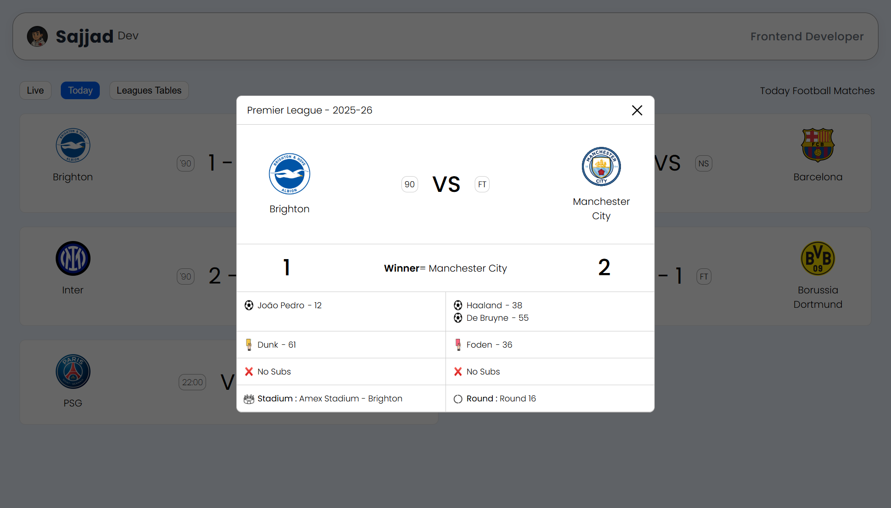
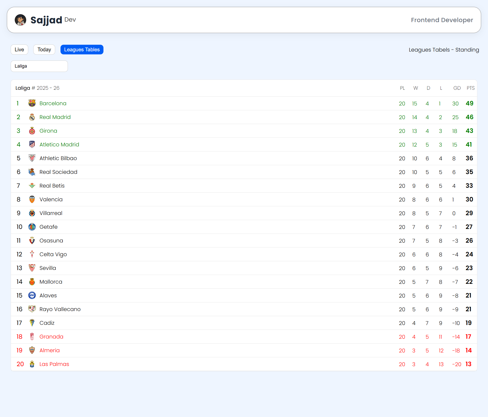

<h1 align="center">⚽️ Modern API Football Page</h1>

  <b>A clean, responsive, and interactive football dashboard built with HTML, CSS & JavaScript</b> 
  🌐 <a href="https://sajjadr17.github.io/modern-api-football-page/">View Live Demo</a> •
  💾 <a href="https://github.com/SajjadR17/modern-api-football-page">View on GitHub</a>

---

## 🎨 Preview

  
  
  
  
  

---

## 🧠 About The Project

Modern API Football Page is a front-end football dashboard designed to replicate real-world sports platforms.

This project focuses on:

- Building interactive, data-driven UI components
- Handling multiple football data types (matches, goals, transfers, league tables)
- Implementing real UX patterns such as modals, tabs, loading states, and empty states
- Enhancing user interaction with hover effects, animations, search, and sorting

The project is API-ready and currently uses structured mock data to keep the focus on UI logic, performance, and user experience.

---

## 📊 Project Sections

- ⚽ Live Matches
- 📅 Today Matches
- 🥅 Goals
- 🔄 Transfers
- 🏆 League Tables

Each section has its own UI logic, interactions, and state handling.

---

## 🌟 Features

✅ Fully responsive & mobile-first design  
✅ Smooth hover effects and subtle UI animations  
✅ Live & Today match views  
✅ Goals section with modal-based match details  
✅ Transfer cards with modern layout and interactions  
✅ League tables with horizontal scroll on mobile  
✅ Tab-based navigation system  
✅ Search functionality for filtering displayed data  
✅ Sorting logic for organized data presentation  
✅ Modal system (open, close, outside click support)  
✅ Loading states for better perceived performance  
✅ Empty states when no data is available  
✅ Clean and modern UI inspired by popular football platforms  
✅ API-ready architecture (currently using mock data)

---

## ⚙️ Tech Stack

| Technology                     | Usage                                 |
| ------------------------------ | ------------------------------------- |
| HTML5                          | Semantic structure                    |
| CSS3 (Flexbox & Media Queries) | Layout, responsiveness & animations   |
| JavaScript (Vanilla)           | Data handling, search & sorting logic |
| Mock Data                      | Matches, goals, transfers & tables    |
| GitHub Pages                   | Deployment                            |

---

## 🚀 Deployment

This project is deployed using GitHub Pages ⚡️

🔗 Live Demo:  
https://sajjadr17.github.io/modern-api-football-page/

---

## 🧭 How To Run Locally

`bash
git clone https://github.com/SajjadR17/modern-api-football-page.git
cd modern-api-football-page
open index.html

---

## 🧾 License

This project is licensed under the MIT License — meaning you're free to use, modify, and share it,  
as long as you give proper credit to Sajjad Roohandeh.
