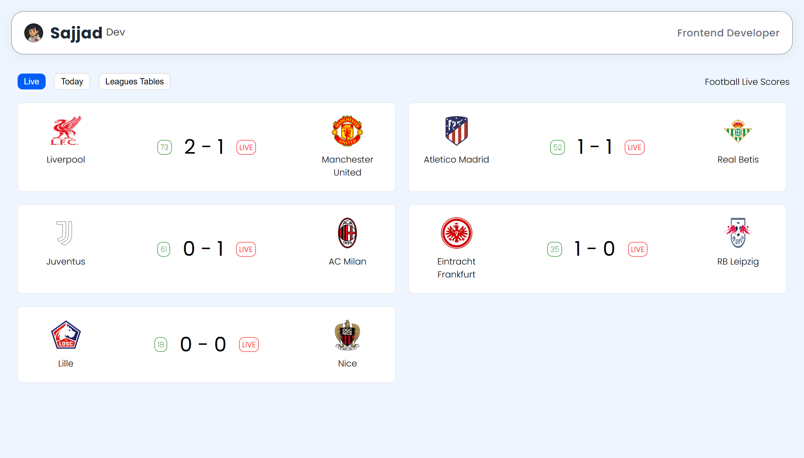
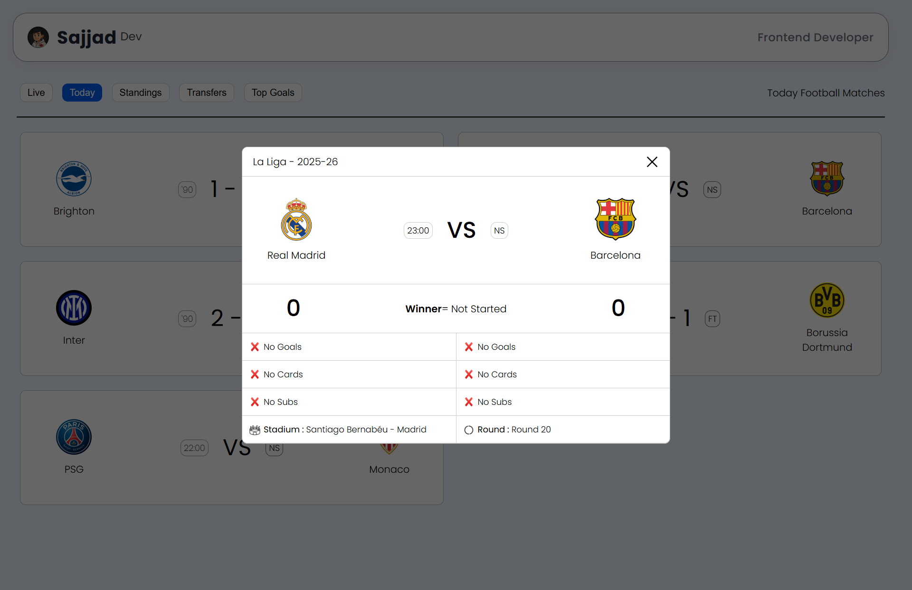

<h1 align="center">⚽ Modern API Football Page</h1>

  <b>A clean, responsive, and modern football live score UI built with HTML, CSS & JavaScript</b> 
  🌐 <a href="https://sajjadr17.github.io/modern-api-football-page/">View Live Demo</a> •
  💾 <a href="https://github.com/SajjadR17/modern-api-football-page">View on GitHub</a>

---

## 🎨 Preview

  
  

---

## 🧠 About The Project

This project is a modern football live score interface designed to practice and showcase front-end development skills.

It includes:
- Live matches view
- Today matches
- League tables with a responsive layout

The main focus of this project is clean UI, mobile-first design, and real-world UX patterns similar to popular sports websites.

---

## ⚙️ Tech Stack

| Technology | Purpose |
|-----------|--------|
| HTML5 | Page structure |
| CSS3 (Flexbox & Media Queries) | Layout & responsiveness |
| JavaScript | Data handling & UI logic |
| Mock / API-ready Data | Matches & league tables |

---

## 🌟 Features

✅ Fully responsive design  
✅ Mobile-friendly league tables with touch horizontal scroll  
✅ Clean and modern UI  
✅ Tab-based navigation (Live / Today / Tables)  
✅ API-ready structure (currently using mock data)  

---

## 🚀 Deployment

Deployed using GitHub Pages ⚡️  
🔗 [View Live Demo](https://sajjadr17.github.io/modern-api-football-page/)

---

## 🧭 How To Run Locally

`bash
git clone https://github.com/SajjadR17/modern-api-football-page.git
cd modern-api-football-page
open index.html
---

## 🧾 License

This project is licensed under the MIT License — meaning you're free to use, modify, and share it,  
as long as you give proper credit to Sajjad Roohandeh.
